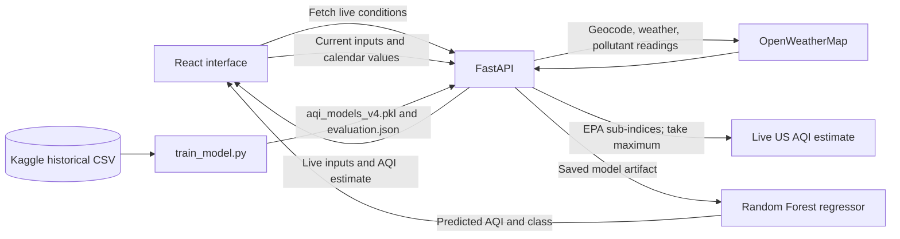

# AeroSense Project Summary

This document describes the project, its data and machine-learning pipeline, evaluation, and the steps required to run it after cloning the repository.

## Project overview

AeroSense is an air-quality application built with a React frontend and a FastAPI backend. It fetches current weather and pollutant readings from OpenWeatherMap, calculates a live AQI estimate, and compares it with an AQI estimate from a locally trained machine-learning model. The UI also includes a model evaluation dashboard.

The historical dataset and trained model are not included in Git. A new clone needs the dataset and a locally generated model before the backend can start. The OpenWeatherMap API key is stored locally in `.env` and must not be committed.

## Data sources and targets

### Historical model dataset

The training workflow uses Kaggle's [Air Quality Dataset: Indian Cities (2022–2025)](https://www.kaggle.com/datasets/bhautikvekariya21/air-quality-dataset-indian-cities-2022-2025), specifically `INDIA_AQI_COMPLETE_20251126.csv`. Download the CSV from the dataset page after signing in to Kaggle. The CSV is not included in this repository.

`train_model.py` expects at least these columns (it normalizes column names to lowercase):

| Dataset column | Use |
| --- | --- |
| `city` | City feature |
| `datetime` | Time ordering and derived calendar features |
| `us_aqi` | Numeric regression target |
| `aqi_category` | Classification target |
| `pm2_5_ugm3`, `pm10_ugm3`, `no2_ugm3`, `so2_ugm3`, `co_ugm3`, `o3_ugm3` | Pollutant features |
| `humidity_percent` | Weather feature |

When available, `temp_2m_c`, `wind_speed_10m_kmh`, `crop_burning_season`, and `festival_period` are used as additional features. Missing optional features are imputed inside the model pipeline. The trainer requires the numeric `us_aqi` target; it does not create labels from pollutant formulas.

### Live readings and the “actual” AQI

The backend obtains city coordinates, current weather, and pollutant concentrations from OpenWeatherMap. It calculates pollutant sub-indices using US EPA breakpoints and uses the highest sub-index as the displayed **Actual live AQI**. OpenWeatherMap's own 1–5 air-pollution category is returned as provider metadata; it is not the number shown as the app's actual AQI.

This live score is an estimate from instantaneous provider readings. It is not an official monitoring-station AQI or a value based on the full regulatory averaging period. The model target is `US_AQI`, so the values share a scale but are produced from different sources and procedures.

## Pipeline



1. **Train:** `train_model.py` validates historical AQI labels, prepares features, compares candidate algorithms, evaluates the selected model, and writes `aqi_models_v4.pkl` and `evaluation.json`.
2. **Fetch:** the frontend requests `GET /live-conditions/{city}`. FastAPI asks OpenWeatherMap for geocoding, weather, and pollutant components, then returns model inputs and `actual_aqi`.
3. **Predict:** the frontend sends those inputs to `POST /predict` with today's year, month, and day. If live data has not already been fetched, the UI fetches it when **Predict AQI** is clicked.
4. **Compare:** the backend runs the input through the saved Random Forest regressor and AQI category classifier. The frontend displays the predicted value beside the live estimate and shows their numerical difference.
5. **Evaluate:** the UI reads `GET /evaluation` to show offline historical metrics, candidate comparisons, an actual-versus-predicted chart, and a category confusion matrix. This dashboard is not an evaluation of the current single live request.

If the user adjusts the pollutant or weather sliders, those changed values are sent to the model. The displayed live AQI remains the fetched provider estimate, so after manual edits the two results may no longer represent identical conditions.

## Model selection and evaluation

The trainer compares HistGradientBoosting, Extra Trees, Random Forest, XGBoost, and LightGBM regressors using three expanding-window time-series validation folds and a shared chronological holdout. Numeric values are imputed inside the pipeline and city names are one-hot encoded. The app uses Random Forest regression and a class-balanced Extra Trees classifier for category labels.

The deployed regressor was selected because it had the lowest MAE on the shared holdout. The current `evaluation.json` reports:

| Metric | Result | Interpretation |
| --- | ---: | --- |
| Regression MAE | 13.67 AQI points | Average absolute numeric error; lower is better |
| Regression RMSE | 22.05 AQI points | Gives larger errors more weight; lower is better |
| Median absolute error | 9.32 AQI points | Median absolute error |
| Regression R² | 0.794 | Variance explained on this holdout; closer to 1 is better |
| Regression MAPE | 16.92% | Percentage error; use caution near zero AQI |
| Category accuracy | 70.9% | Share of category labels predicted correctly |
| Category balanced accuracy | 65.1% | Average recall across classes |
| Category macro F1 | 60.5% | Balances precision and recall across classes |

The median-only regression baseline MAE is 36.47 AQI points. The report contains 166,581 holdout examples from March 30 through November 26, 2025, and 673,063 training rows. Severe AQI readings are rarer and harder to predict, so overall metrics do not imply equal performance in every category.

**Evaluation caveat:** the shared holdout MAE is used to select the deployed model. These are useful model-selection results, but not an independent final estimate of generalization. A later time window not used in selection would provide a stronger final evaluation. See [MODEL_EVALUATION.md](MODEL_EVALUATION.md) for additional methodology and category-level detail.

## Run locally after cloning

These steps use Windows PowerShell. Run the training, backend, and frontend in separate terminals when indicated.

### 1. Clone the repository

```powershell
git clone <your-repository-url>
cd AQI-prediction
```

Replace `<your-repository-url>` with your GitHub repository URL. If the project is already on your computer, open PowerShell in its root folder.

### 2. Set up Python

Use Python 3.11 or newer:

```powershell
py -3.11 -m venv .venv
.\.venv\Scripts\Activate.ps1
python -m pip install --upgrade pip
python -m pip install -r requirements.txt
```

If PowerShell blocks activation, allow scripts for the current terminal session and activate again:

```powershell
Set-ExecutionPolicy -Scope Process -ExecutionPolicy Bypass
.\.venv\Scripts\Activate.ps1
```

### 3. Add your OpenWeatherMap key

Create a local `.env` file from the placeholder and edit it:

```powershell
Copy-Item .env.example .env
notepad .env
```

Put your key after the equals sign:

```text
OPENWEATHER_API_KEY=your_real_key_here
```

Save the file. `.env` is ignored by Git. Never commit or publish the key. The backend uses OpenWeatherMap geocoding, current weather, and air-pollution endpoints. A newly issued key may take time to activate.

### 4. Download the dataset

1. Sign in to [Kaggle](https://www.kaggle.com/datasets/bhautikvekariya21/air-quality-dataset-indian-cities-2022-2025).
2. Download `INDIA_AQI_COMPLETE_20251126.csv`.
3. Save it locally, for example as `.\data\INDIA_AQI_COMPLETE_20251126.csv`. The `data` folder and CSV files are ignored by Git.

Alternatively, install optional notebook dependencies and use KaggleHub:

```powershell
python -m pip install -r requirements-notebook.txt
python -c "import kagglehub; print(kagglehub.dataset_download('bhautikvekariya21/air-quality-dataset-indian-cities-2022-2025'))"
```

The command prints the cache directory. Find the CSV there and pass its full path to the trainer. If KaggleHub requires credentials or fails, downloading through the Kaggle website is a simple alternative.

### 5. Train and generate local model files

From the project root, with the virtual environment active:

```powershell
python train_model.py --data ".\data\INDIA_AQI_COMPLETE_20251126.csv"
```

Training compares the model candidates and can take a while. On completion it creates:

- `aqi_models_v4.pkl` — model artifact required by FastAPI.
- `evaluation.json` — model metrics and comparison data served to the frontend.

The model artifact is ignored by Git. The checked-in `evaluation.json` is the last documented report; retraining overwrites it. Keep the model and report from the same run together. If the data is already in the trainer's default KaggleHub cache path, you may omit `--data`; explicitly passing the path avoids cache-location issues.

### 6. Start the backend

In the project root, with the virtual environment active and model artifact generated:

```powershell
uvicorn main:app --reload
```

The API runs at `http://127.0.0.1:8000`. Visit `http://127.0.0.1:8000/docs` for interactive endpoint documentation.

### 7. Start the frontend

Open another PowerShell terminal in the repository and run:

```powershell
cd aqi-frontend
npm ci
npm start
```

Install Node.js (including npm) first if those commands are unavailable. The frontend runs at `http://localhost:3000`. Open the predictor, choose a city, click **Fetch live conditions**, and then **Predict AQI**. The result panel shows live and predicted AQI; the dashboard below contains historical model evaluation.

## API endpoints

| Method and path | Purpose |
| --- | --- |
| `GET /live-conditions/{city}` | Fetch current conditions and return inputs plus the EPA-based live AQI estimate. |
| `POST /predict` | Return numeric model prediction and predicted category for submitted inputs. |
| `GET /evaluation` | Return the generated report used by the evaluation dashboard. |
| `GET /docs` | Interactive FastAPI API documentation. |

The API key is read by FastAPI from the project-root `.env`. The React application does not need direct access to the key. Keep the backend running while using the frontend. CORS permits the local frontend ports `3000` and `5173`.

## Troubleshooting

| Symptom | What to check |
| --- | --- |
| Model artifact not found | Run `python train_model.py --data "<csv-path>"` from the project root. |
| Dataset not found | Check the CSV path and filename; quote paths containing spaces. |
| Missing dataset columns | Confirm you downloaded the expected Kaggle CSV listed above. |
| `OPENWEATHER_API_KEY` missing | Check that the root `.env` exists, uses the exact variable name, and restart the backend after edits. |
| OpenWeatherMap 401/403 | Check for a typo, allow time for key activation, and confirm API access is enabled. Do not put the key in the browser. |
| City not found | Check the city spelling; the backend searches for the selected city in India. |
| Frontend cannot reach backend | Keep Uvicorn running on port 8000 and React on port 3000; check both terminals. |
| KaggleHub download issue | Download the CSV through Kaggle or configure Kaggle credentials, then pass the CSV path explicitly. |

## Important files

| File | Purpose |
| --- | --- |
| `main.py` | FastAPI routes, OpenWeatherMap integration, live AQI calculation, and inference. |
| `train_model.py` | Dataset checks, temporal model comparison, training, and report generation. |
| `aqi-frontend/src/` | React interface and evaluation dashboard. |
| `requirements.txt` | Backend and model-training Python dependencies. |
| `requirements-notebook.txt` | Optional notebook and KaggleHub dependencies. |
| `.env.example` | Safe placeholder for the required API key variable. |
| `MODEL_EVALUATION.md` | Model evaluation methodology and current results. |
| `02_recent_data.ipynb` | Older exploratory notebook; not the app's current training entry point. |

## Limitations

- The live AQI estimate is not a substitute for official station data and regulatory averaging periods.
- The model and live estimate use the US AQI scale but are derived differently; their difference alone does not measure model accuracy.
- Evaluation results depend on this dataset and its time period. City coverage, changing pollution patterns, rare severe cases, and selection on the holdout limit how broadly they generalize.
- Crop-burning and festival indicators are not supplied by OpenWeatherMap. The current UI values for those fields are used for live model predictions unless the user changes them.
